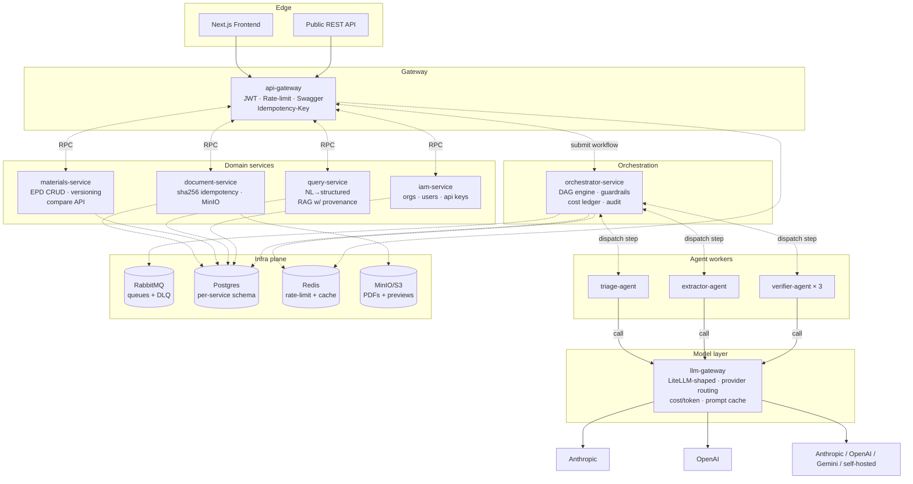
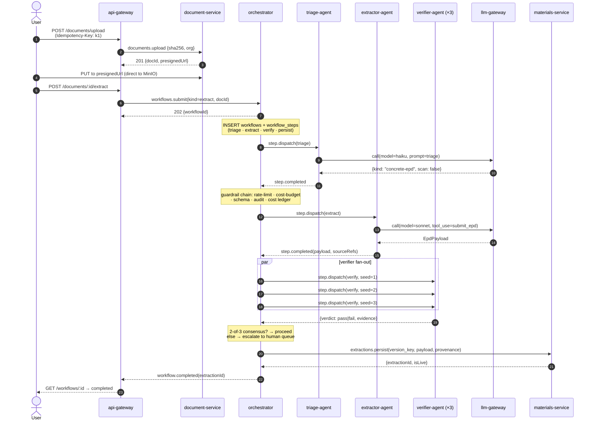

# Architecture

This is the load-bearing document. Everything else in the repo derives from decisions justified here.

## 1. What the system does

The platform takes a heterogeneous stream of Environmental Product Declaration (EPD) PDFs from concrete/steel/timber suppliers and turns them into a **queryable, versioned, provenance-linked** dataset that a non-expert can use to compare embodied-carbon impact **stage by stage**, honestly (a not-declared life-cycle stage is never silently rendered as zero).

The two workloads it must serve:

1. **Extraction** — an inbound PDF becomes a validated, version-keyed row with per-field provenance. This is a **multi-agent workflow**, not a single LLM call.
2. **Query** — a natural-language question ("cheapest 32MPa concrete in Victoria available Q3?") becomes a structured DB query with cited sources in the answer.

The one contract that outranks every other design choice: **every carbon figure must trace back to its source EPD page.** A number without provenance is worse than no number.

## 2. System topology



Every arrow labelled "RPC" is a RabbitMQ `MessagePattern`. The orchestrator is the only service that talks to the agent workers; nothing else knows agents exist.

## 3. Extraction workflow — the vertical slice we build



Why this shape:

- **Triage before extract**. A cheap Haiku call routes: text-PDF vs scan, concrete vs steel, single-mix vs multi-mix. Wrong extractor is the highest-cost failure mode — pay 1¢ to avoid 40¢.
- **Verifier fan-out, not sequential re-check**. Three parallel adversarial verifiers with different seeds; 2-of-3 consensus. A single verifier is theatre — it makes the same mistake as the extractor. Diverse verifiers are the point.
- **Persist as staged, promote atomically**. The extraction lands with `is_live = false`. Only after consensus does an `UPDATE` flip `is_live = true` and set the previous live row's `superseded_by`. Readers see a consistent snapshot; there is no window where "half-verified" data leaks into the UI.

## 4. The DB — where the real decisions live

Per-service schemas on a single Postgres instance in dev, physically separated in prod. Foreign keys don't cross service boundaries; **cross-service references are IDs, not enforced FKs**.

### 4.1 Version-key idempotency

Extractions are keyed by a **7-tuple**:

```
version_key = hash(document_id, revision, extractor_name, model_id, prompt_version, schema_version, chunk_config)
```

A retry with identical inputs collides on this key and short-circuits. A prompt rev increments `prompt_version` → new row, old row survives as history. A schema rev creates staged rows that coexist with live rows until an operator promotes.

```sql
CREATE TABLE extractions (
  id UUID PRIMARY KEY,
  document_id UUID NOT NULL,
  version_key TEXT NOT NULL,
  status extraction_status NOT NULL,      -- pending, running, staged, live, failed, superseded
  prompt_version TEXT NOT NULL,
  model_id TEXT NOT NULL,                 -- e.g. "claude-sonnet-4-6"
  schema_version TEXT NOT NULL,
  extractor_name TEXT NOT NULL,           -- e.g. "concrete-extractor-v1"
  epd_data JSONB NOT NULL,                -- validated by Zod at write time
  is_live BOOLEAN NOT NULL DEFAULT FALSE,
  superseded_by UUID REFERENCES extractions(id),
  processing_lock_token TEXT,
  processing_lock_expires_at TIMESTAMPTZ,
  cost_usd NUMERIC(10, 4),
  started_at TIMESTAMPTZ,
  completed_at TIMESTAMPTZ,
  UNIQUE (version_key)
);

-- At most one live extraction per material at a time.
CREATE UNIQUE INDEX one_live_per_material
  ON extractions (document_id) WHERE is_live IS TRUE;
```

### 4.2 Provenance as a first-class table, not JSONB

```sql
CREATE TABLE provenance_snippets (
  id UUID PRIMARY KEY,
  extraction_id UUID NOT NULL REFERENCES extractions(id) ON DELETE CASCADE,
  field_path TEXT NOT NULL,               -- e.g. "lifeCycle.A1-A3.gwpTotal"
  page_number INT NOT NULL,
  snippet TEXT NOT NULL,
  confidence provenance_confidence NOT NULL,
  method provenance_method NOT NULL,
  bounding_box JSONB                      -- {x, y, w, h} when vision-LLM gave it
);
CREATE INDEX ON provenance_snippets (extraction_id);
CREATE INDEX ON provenance_snippets (field_path);
```

We denormalize out of the JSONB `epd_data` on purpose. Two use cases only make sense with a table:

1. **"Show me every field where confidence < high"** — one query, milliseconds. In JSONB, it's a full-corpus scan.
2. **"Which pages of source X are cited most often across extractions?"** — analytics that would require GIN indexes and jsonpath acrobatics against a JSONB blob.

### 4.3 Cost as a first-class table, not a column

```sql
CREATE TABLE cost_ledger (
  id BIGSERIAL PRIMARY KEY,
  org_id UUID NOT NULL,
  workflow_id UUID,
  step_id UUID,
  provider TEXT NOT NULL,                 -- anthropic, openai, google
  model_id TEXT NOT NULL,
  input_tokens INT NOT NULL,
  cache_read_tokens INT NOT NULL DEFAULT 0,
  output_tokens INT NOT NULL,
  cost_usd NUMERIC(12, 6) NOT NULL,
  created_at TIMESTAMPTZ NOT NULL DEFAULT NOW()
);
CREATE INDEX ON cost_ledger (org_id, created_at);
CREATE INDEX ON cost_ledger (workflow_id);
```

Cost lives in its own table for the same reason `orders` and `payments` live apart from `products`: the read patterns are different (aggregations per org / per day / per model), the retention is different (compliance may require 7 years), and it's the natural pivot for **budget enforcement** — the orchestrator's cost-guard `SELECT SUM(cost_usd) FROM cost_ledger WHERE org_id=$1 AND created_at > date_trunc('day', now())` before every LLM call.

### 4.4 Audit as append-only events

```sql
CREATE TABLE extraction_events (
  id BIGSERIAL PRIMARY KEY,
  extraction_id UUID NOT NULL,
  event_type TEXT NOT NULL,               -- 'started', 'guardrail.rejected',
                                          -- 'llm.called', 'validation.failed',
                                          -- 'consensus.reached', 'promoted', ...
  payload JSONB NOT NULL,
  actor TEXT NOT NULL,                    -- 'orchestrator', 'human:<user_id>', ...
  created_at TIMESTAMPTZ NOT NULL DEFAULT NOW()
);
```

Never `UPDATE`. Never `DELETE`. Retention policy handled at the table level (partition by month, drop old partitions). Every actor writes here; the answer to "how did this row become the way it is?" is a `SELECT * FROM extraction_events WHERE extraction_id=$1 ORDER BY created_at`.

## 5. The guardrail chain

Every call to `llm-gateway.call()` is wrapped in a middleware chain by the orchestrator. In order:

```ts
llm-gateway.call
  ← rate-limit-guard(provider, model, org_id)      // Redis token bucket, per-org+model
  ← cost-budget-guard(org_id, workflow_id)         // SELECT SUM(cost_usd) < org.daily_limit_usd
  ← prompt-schema-guard(prompt_version)            // reject prompts not in prompts.registry
  ← content-policy-guard(input)                    // PII, prompt-injection heuristics
  ← [ CALL ]
  ← grounding-guard(output, source_refs)           // pdf-parse substring check on cited pages
  ← audit-emit(extraction_events, cost_ledger)     // append-only, single transaction
```

A guard that fails short-circuits the chain — the step transitions to `failed` with a typed reason (`budget_exceeded`, `content_policy_violation`, etc.). The orchestrator's retry policy differs per reason: `rate_limited` retries with backoff; `budget_exceeded` pauses the workflow and surfaces in an operator UI; `validation_failed` escalates to human review.

Guards are pluggable — a new guard is a class implementing `Guard<Input, Output>`. The chain is composed at boot from config, so a customer with stricter content policy just gets a longer chain, not a code change.

## 6. Vertical slice — what's actually built in this repo

The scope of code (not docs) in this repo is the extraction workflow, all the way through. Everything else is documented interfaces + typed stubs + TODOs pointing back here.

- ✅ `base-framework` — Zod contracts, `LLMGateway` interface, RMQ patterns, cost ledger writer, guard chain composition, EntityBase
- ✅ `base-worker` — shared queue-consumer scaffold; every agent uses it
- ✅ `deploy/docker-compose.yml` + `deploy/postgres/init.sql` — full stack boots with one command
- ✅ `api-gateway` — `POST /documents/upload`, `POST /documents/:id/extract`, `GET /workflows/:id`, `GET /extractions/:id`. JWT + Swagger + Idempotency-Key.
- ✅ `document-service` — sha256 idempotency, presigned MinIO URLs
- ✅ `orchestrator-service` — DAG engine, guardrail chain, retry, cost ledger writer, event emitter
- ✅ `llm-gateway` — `AnthropicBackend` (real, uses `@anthropic-ai/sdk` and PDF input), `OpenAIBackend` (stub returning a canned response — proves the swap is real, not aspirational)
- ✅ `agent-workers/triage` — Haiku call, JSON output, tiny prompt
- ✅ `agent-workers/extractor` — Sonnet + `tool_use`, same prompt as v1 (proven)
- ✅ `agent-workers/verifier` — `pdf-parse` substring-ground + a "does this smell plausible?" LLM cross-check
- ✅ `materials-service` — persistence, version-key idempotency, provenance table writes
- ✅ End-to-end script: `pnpm e2e:extract path/to/epd.pdf` — proves the whole chain

Not built, only documented:
- ✗ `query-service` (NL → SQL RAG) — the workflow shape mirrors extraction; `docs/ARCHITECTURE.md` §7 walks the sequence
- ✗ `iam-service` real implementation — dev uses a hard-coded org + service-account JWT; the interface is designed for scope, not shipped
- ✗ Frontend v2 — v1's UI is compatible if pointed at this gateway
- ✗ Human-review UI — the DB has `status=needs_review` + `extraction_events`; the UI is out of scope

## 7. ADRs — decisions worth defending

| Decision | Alternative | Why |
| --- | --- | --- |
| **NestJS everywhere** | Fastify + custom DI | NestJS' `@nestjs/microservices` + `MessagePattern` + typed DTOs is the most idiomatic RPC pattern in TS. Fastify is faster per request; irrelevant at our scale. |
| **RabbitMQ, not Kafka** | Kafka | Extraction is request/response with retries and DLQ — RabbitMQ's `deadLetterExchange` + `messageTtl` is exactly right. Kafka's log-oriented model doesn't fit "one workflow → one result." Kafka's the answer for the event bus we'd add for **analytics** downstream. |
| **Postgres, not a document DB** | MongoDB, DynamoDB | Every honesty invariant we care about (version-key idempotency, one-live-per-material, foreign-key-adjacent constraints, cost ledger integrity) leans on unique indexes + partial indexes + serializable transactions. Postgres JSONB gives us the "flexible payload" affordance of a document DB without giving up any of that. |
| **Per-service schemas, one Postgres instance in dev** | One DB per service on separate hosts | Operational simplicity when you're one person. Production shape (`shared_preload_libraries=pg_stat_statements` + independent instances) is a config change, not an architecture change. |
| **Idempotency by content hash + version key** | Client-generated UUIDs | Content hash makes "did I already extract this?" a `SELECT` instead of a coordination protocol. Version key generalizes: "did I already extract this **with this configuration**?" |
| **Provenance as a table, not JSONB** | JSONB with GIN + jsonpath | See §4.2. Two real queries would require jsonpath acrobatics; the table makes them trivial. |
| **Verifier fan-out, N-of-M consensus** | Single verifier + retry | A single verifier is a Turing-Test-passing sycophant when its inputs look like they came from the same model. Diverse models + diverse seeds + majority vote is the standard antidote. |
| **Staged + live extractions** | Overwrite in place | Overwriting is what makes a bad prompt update globally poison the dataset. Staged rows let us A/B a new prompt, verify it on a subset, and promote atomically. |
| **LiteLLM-shaped `llm-gateway`** | Direct Anthropic SDK calls | Provider lock-in at platform scale is a real risk (pricing, rate limits, model deprecation, regional/regulatory availability). The gateway is the abstraction that lets a customer flip Anthropic→Gemini without touching agent code. |
| **Guardrails as a middleware chain** | Ad-hoc checks scattered in agents | Chains compose. A new guard (e.g. per-document PII scrub) is a class, not a code sweep across services. |

## 8. Scale path

What breaks first, roughly ordered by throughput:

1. **~100 PDFs/day**: nothing breaks. This is the shape you build.
2. **~1k/day**: `llm-gateway` becomes the bottleneck if you're single-tenant on Anthropic. Turn on **prompt caching** on the extraction system prompt (4k tokens, identical across runs → ~90% discount). Add **page-targeting** — cheap Haiku call to identify the LCA-results page(s), only those go to Sonnet.
3. **~10k/day**: rate limits bite. `llm-gateway` picks up **provider fan-out** — configure it to load-balance Anthropic + OpenAI + Google for the same logical model; each provider's rate limit is a separate token bucket in Redis.
4. **~100k/day**: Postgres becomes the bottleneck. Partition `extractions` by month; move `cost_ledger` to a dedicated instance (or ClickHouse — its natural fit for time-series aggregation). Add a **read replica** for the query-service.
5. **~1M/day**: worker autoscaling. `orchestrator-service` becomes a control plane; the agent workers are stateless and horizontal. Kubernetes with HPA on RMQ queue depth. RMQ itself gets clustered.

The important thing: none of these require re-architecting. Every scaling move is a knob on the existing shape.

## 9. Where the code lands

- Start reading: `packages/base-framework/src/contracts` — the Zod schemas everything else conforms to
- Then: `services/orchestrator-service/src/workflow` — the DAG engine
- Then: `services/llm-gateway/src/backends` — the provider abstraction
- Then: `services/agent-workers/src` — how a step consumer is written
- The end-to-end test at `scripts/e2e/extract.ts` walks the exact sequence from §3.
